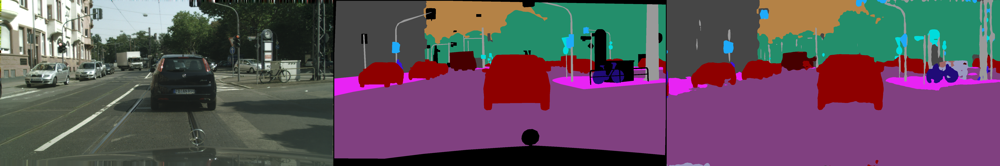

# Mobilenetv3 real-time segmentation
[![python-image]][python-url]
[![pytorch-image]][pytorch-url]
[![lic-image]][lic-url]

This repository contains the implementation for a dual-path network with [mobilenetv3-small](https://arxiv.org/abs/1905.02244) backbone. I have used [PSP module](https://arxiv.org/abs/1612.01105) as the context aggregation block.    

<p align="center">
</br>
</p>

## Requirements

The Cityscapes dataset, which can be downloaded  [here](https://www.cityscapes-dataset.com/).

NOTE: The code has been tested in Ubuntu 18.04, and **requirements.txt** contains all the nessary packages.


## Usage
-----------------
### Train
To train the model,  we run train.py
```
python3 train.py --root Cityscapes_root_directory --model_path optional_param, to resume training from a checkpoint.
``` 
### Evaluate
The trainer, also evaluates the model for every save and logs the results, but if evaluation needs to be done for a particular model, we run evaluate.py

```
python3 evaluate.py --root Cityscapes_root_directory --model_path saved_model_path_to_evaluate.
``` 

### Evaluate Server
The evaluate_server.py evaluates the model, and store the segmentation masks in *cityscapes_results* folder created in the root path of the script. This is used for submiting the results to [Cityscapes](https://www.cityscapes-dataset.com/) evaluation server.

```
python3 evaluate_server.py --root Cityscapes_root_directory --model_path saved_model_path_to_evaluate.
``` 

### Demo

To visulaize the results,  we run demo.py.

```
python3 demo.py --root Cityscapes_root_directory --model_path saved_model_path_to_run_demo.
``` 

## Result
The FPS metrics are evaluated on a RTX2070. And evaluation was done by single scale input images. 

- **Cityscapes**

| Config   		          |  Params(M) | RES      | FLOPS (G) | FP32(fps) | FP16(fps)| train-split       |  mIoU - val | mIoU - test |      model      |
| :-------:             | :--:       | :----:   | :----:    | :---:     | :-------:| :------:          | :------:    | :------:    |     :------:    |  
| MV3-Small + PSP + FFM |   1.74     |2048x1024 | 11.63     |  40.85    |   54.50  |    train          |  0.662      |    0.6388   | [file (6.86MB)](https://www.mediafire.com/file/lqf9bjvjqs0bfli/MobilenetV3_small_segmentation.pth/file) |
| MV3-Small + PSP + FFM |   1.74     |1024x512  |  2.91     |  78.79    |   71.74  |    train          |  0.615      |     -       | [file (6.86MB)](https://www.mediafire.com/file/lqf9bjvjqs0bfli/MobilenetV3_small_segmentation.pth/file) |
| MV3-Small + PSP + FFM |   1.74     |2048x1024 | 11.63     |  40.85    |   54.50  |    train + val    |  0.717      |             | [file (6.86MB)](https://www.mediafire.com/file/tlj3jnso2707x5k/MobilenetV3_small_segmentation_80k.pth/file) |
| MV3-Small + PSP + FFM |   1.74     |1024x512  |  2.91     |  78.79    |   71.74  |    train + val    |  0.646      |     -       | [file (6.86MB)](https://www.mediafire.com/file/tlj3jnso2707x5k/MobilenetV3_small_segmentation_80k.pth/file) |

Note: Params and FLOPS are got using [torchstat](https://github.com/Swall0w/torchstat). 

## To Do
- [ ] Add mobilenetv3 large
- [ ] Improve performance. 
- [ ] Add more configurations support. 


<!--
[![python-image]][python-url]
[![pytorch-image]][pytorch-url]
[![lic-image]][lic-url]
-->

[python-image]: https://img.shields.io/badge/Python-3.x-ff69b4.svg
[python-url]: https://www.python.org/
[pytorch-image]: https://img.shields.io/badge/PyTorch-1.x-2BAF2B.svg
[pytorch-url]: https://pytorch.org/
[lic-image]: https://img.shields.io/badge/License-MIT-yellow.svg
[lic-url]: https://github.com/Tramac/mobilenetv3-segmentation/blob/master/LICENSE
